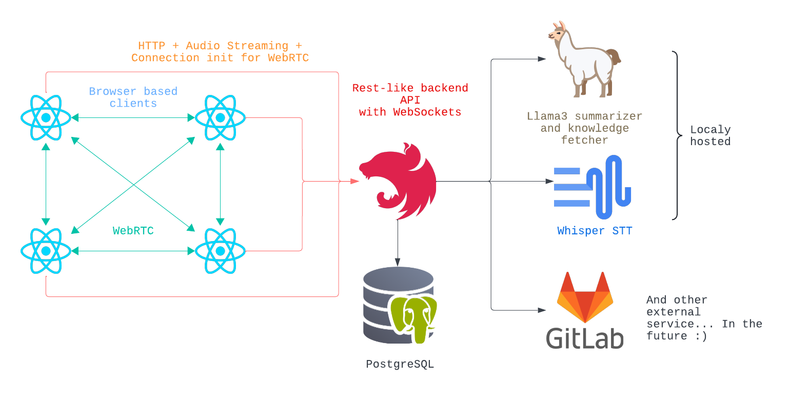

  

[Dragonhack 2024](https://dragonhack.si/) project

- [Jan Vasiljević](https://github.com/janvasiljevic)
- [Jakob Mrak](https://github.com/mrakjakob)
- [Enei Sluga](https://github.com/smufa)
- [Lan Vukušič](https://github.com/LanVukusic)

# LLocalCaLL

We've developed a privacy-focused, self-hosted enterprise conferencing solution with AI-powered features. Within 24 hours, we've built a system capable of supporting up to 4 concurrent users in a meeting, complete with video and audio capabilities. All speech is transcribed, and at the conclusion of each meeting, a summary is automatically generated. Talking points are seamlessly linked to external project management tools (currently GitLab), and issues are directly referenced within the respective transcripts. Our primary selling point is that all this sensitive data never leaves the company's infrastructure. This stands in contrast to other solutions on the market, where data is stored on the servers of the conferencing provider. Our data is securely stored in a PostgreSQL database. Queries for issue searching are handled by LLama3, while speech-to-text conversion is managed by Whisper. Conferencing between participants is made using WebRTC, ensuring crisp audio and video quality (surpassing Zoom and Meet). The frontend is built using React and Mantine. The project is leveraging open-source technologies to deliver a surprisingly robust user experience. With our solution, there's no need to relinquish control of your data to Google, OpenAI, Zoom, or any other company :)

Self hosted, enterprise conferencing solution. Use open-source models on your own infrastructure.

## Problem

With the shift towards remote work post-COVID-19 in 2022, many companies have come to rely heavily on proprietary solutions
like **Zoom** or **MS Teams**. However, this reliance raises concerns about:

- **Data Security**: Are your meetings and conversations secure? Can you trust that your sensitive business discussions will remain confidential?
- **Vendor Lock-In**: Are you reliant on a third-party service that could potentially disappear or change its terms at any moment, leaving your organization in a difficult position?
- **Customization**: Can you customize the meeting experience to fit your company's unique needs? Or is it a one-size-fits-all approach that may not meet your organization's specific requirements?
- **Cost**: Are you paying a premium for features and services you don't need, or are you being charged by the minute or per-user?

By relying on proprietary conferencing solutions, organizations may be sacrificing control, security, and customization for
the sake of convenience. With LocalCaLL, you can take back control over your online meetings and provide a better experience
for your employees and customers.

## Solution

LLocalCaLL offers a self-hosted, enterprise conferencing solution that empowers you to take control of your online meetings.
Our solution is built on top of open-source technologies, ensuring transparency, flexibility, and customizability.

We utilize the following open-source technologies to bring you a robust and scalable conferencing experience:

- **WebRTC** for video conferencing: This widely-used standard enables peer-to-peer real-time communication, ensuring
  high-quality video and audio transmission.
- **React** and **Mantine** for the web app: Our frontend is built using these popular JavaScript libraries, providing a
  seamless user experience and allowing for easy customization.
- **Node.js** and **NestJS** for the backend: We leverage these powerful Node.js frameworks to build a robust and scalable
  server-side infrastructure.
- **Whisper** for live transcriptions: This open-source transcription service enables real-time captioning of your meetings,
  making it easier for participants to follow along.
- **Ollama** and **LangChain** running **LLaMA3** for summaries: These AI-powered tools help generate concise summaries of your
  meetings, providing a quick recap of key discussion points.

By using open-source technologies, we can:

- Ensure the security and transparency of our solution
- Benefit from community-driven development and bug fixing
- Provide customizability and flexibility to meet your organization's specific needs
- Reduce costs associated with proprietary solutions

With LLocalCaLL, you can host secure, web-based meetings with video, audio, and screen sharing capabilities. Our intuitive
interface makes it easy to manage meetings, integrate with existing infrastructure and services, and scale your conferencing
solution as needed.
